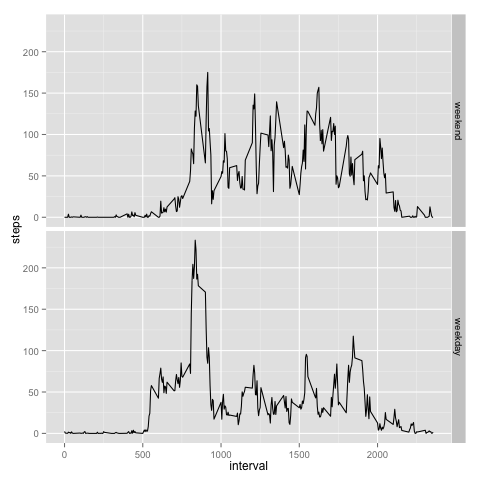

##Load activity data:

```{r, echo = TRUE}
activity <- read.csv("./activity.csv", header=TRUE, stringsAsFactors = FALSE)
```

##Calculate the total number of steps taken per day:

```{r, echo=TRUE}
totSteps <-aggregate(steps ~ date, activity, sum)
totSteps
```

##Generate histogram of the total number of steps taken each day:

```{r, echo = TRUE}
png(file="TotSteps.png")
with(totSteps, hist(steps, main="The total number of steps ", xlab = "steps", col="lightgray"))
##dev.off()
```

##Histogram of the total number of steps taken each day:


##Calculate and report the mean and median of the total number of steps taken per day

```{r, echo=TRUE}
##mean and median of the total number of steps taken per day
meanStep <- mean(totSteps$steps)
medianStep <- median(totSteps$steps)
```

The mean of the toal number of steps taken per day: `r meanStep[1]`  
The median of the total number of steps taken per days: `r medianStep[1]`  

##Make a time series plot:

```{r, echo=TRUE}
## time series plot
inerv <-aggregate(steps ~ interval, activity, mean, na.rm = TRUE)
require(ggplot2)
ggplot( data = inerv, aes( interval, steps )) + geom_line() 
## max number of steps in a 5-mins interval
maxInter <- inerv[which.max(inerv[,2]),1]
```

`r maxInter` interval has the maximum number of steps  

##Calculate and report the total number of missing values in the dataset

```{r, echo=TRUE}
totNum <- length(which(is.na(activity$steps)))
```
The total number of missing values is `r totNum`

##Fill in the missing data
```{r, echo=TRUE}
##imputing missing values

v <- aggregate(steps ~ interval, activity, mean, na.rm = TRUE)
activity[which(is.na(activity$steps)),]$steps <- v[v$interval == activity[which(is.na(activity$steps)),]$interval,]$steps

TotStepsByDay <- aggregate(steps ~date, activity, sum)
TotStepsByDay

png(file="TotStepsByDay.png")
with(TotStepsByDay, hist(steps, main="The total number of steps by day", xlab = "steps", col="lightgray"))
##dev.off()
```


```{r, echo=TRUE}
meanStepsAfterImpute = mean(TotStepsByDay$steps)
medianStepsAfterImpute = median(TotStepsByDay$steps)
```

The mean of the total number of steps per day after data impute is `r meanStepsAfterImpute`   
The median of the total number of steps per day after data impute is `r medianStepsAfterImpute`  


Those 2 values are not significantly different from the values caculated in first part of the assignment. So the impact of imputing missing data on the estimates of the total dialy number of steps is very minimal to none.

##Create factor variable in dataset for weekday
```{r, echo=TRUE}
weekdays1 <- c('Monday', 'Tuesday', 'Wednesday', 'Thursday', 'Friday')
activity$date <- as.Date(activity$date)
activity$wDay <-  factor((weekdays(activity$date) %in% weekdays1)+1L,
      levels=1:2, labels=c('weekend', 'weekday'))
```

##Make time series plots for Weekday and Weekend
```{r, echo=TRUE}
library(ggplot2)
wkSteps <-aggregate(steps ~ interval+wDay, activity, mean)
png(file="wkSteps.png")
qplot(interval, steps, data=wkSteps, geom = "line", facets =wDay~.)
##dev.off()
```  
